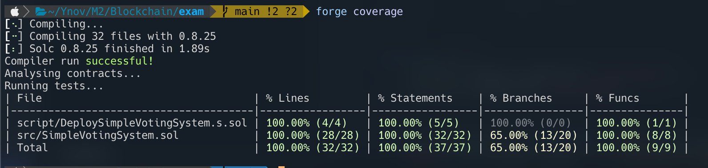

# Ynov Rennes Campus - Blockchain

Ce projet est une évaluation finale pour le module `"Blockchain"` du Mastère 2 Informatique à Ynov Rennes Campus.

Voici l'énoncé :

1. Ajouter un rôle d'administrateur à l'aide d'OpenZeppelin
2. La fonction qui permet d'enregistrer des candidats ne pourra être exécutée que par les administrateurs.
3. Actuellement le smart contract ne définit pas d’ordre dans lequel exécuter les fonctions. Il est possible de voter avant même que les candidats soient enregistrés. Ce qui n’est pas correct.
   Faites en sorte de définir un statut de workflow pour le smart contract qui peut prendre 4 valeurs : REGISTER_CANDIDATES, FOUND_CANDIDATES, VOTE, COMPLETED.
   De fait, quand le statut du workflow sera à l’état REGISTER_CANDIDATES, seule la fonction d’enregistrement des candidats pourra être exécutée.
   Quand le statut sera à l’état VOTE, seule la fonction de vote pourra être exécutée. etc ….
   Seul un administrateur pourra modifier le statut du workflow
4. Ajouter un rôle de FOUNDER qui permettra à chaque candidat de recevoir des fonds. Donc seuls les founders pourront envoyer des fonds aux candidats
5. Faites en sorte que la fonction de vote qui n’a pas de restriction de rôle puisse être exécutée uniquement 1 heure après que le statut VOTE ait été set par l’administrateur
6. Ajouter une fonction qui désigne le vainqueur du vote en fonction du bon statut de workflow
7. Réaliser les test unitaires dans Foundry pour ce smart contract
8. Quand vous avez implémenté une fonction, implémenter immédiatement 1 ou plusieurs tests unitaires correspondants. Donc ne passez pas à l’implémentation d’une fonction sans avoir fait de TU.
   Toute fonction sans TU ne seras pas prise en compte

## Coverage

## Auteur

Alex DURAND (me)
